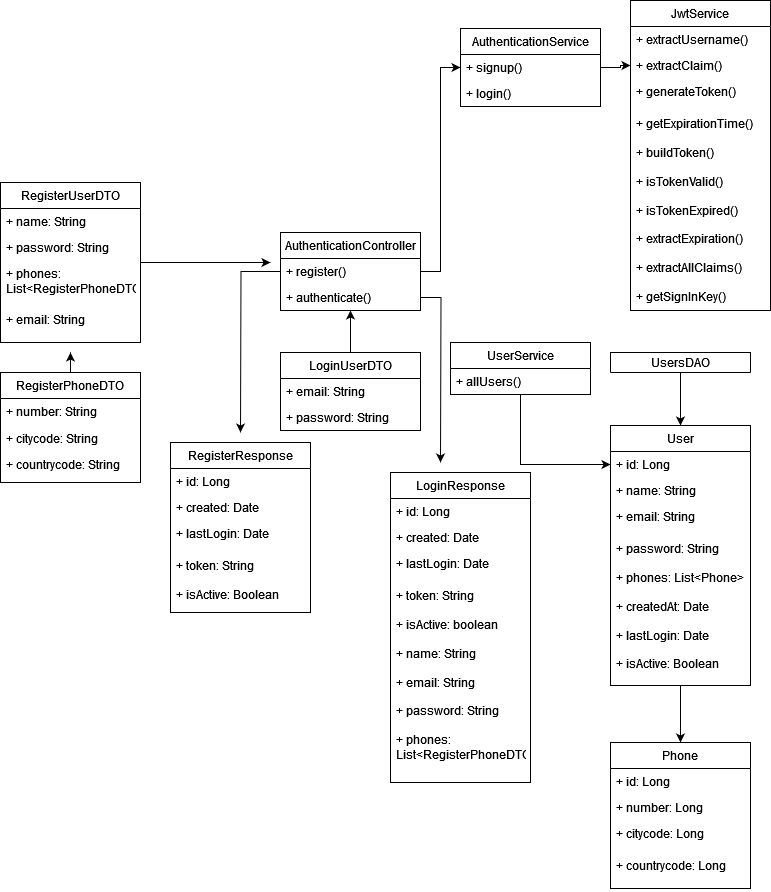
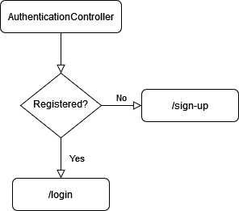

# Test de GlobalLogic - Fullstack Java Senior
Este es el back-end del test de Sermaluc, desarrollado en SpringBoot.

## Iniciar
Para ejecutar la aplicación se debe utilizar el comando ./gradlew bootRun.

## Tests
Los test están desarrollados utilizando JUnit. Se encuentran dentro de src/test, y se pueden ejecutar desde IntelliJ.

## Endpoints
Los endpoints disponibles en la web API son los siguientes:

- **/sign-up:** Registra un nuevo usuario.
- **/login:** Inicia sesión con el token JWT de un usuario ya registrado.

## Esquemas

### Esquema de componentes

Esquema de componentes:

### Esquema de secuencia

Esquema de secuencia:

